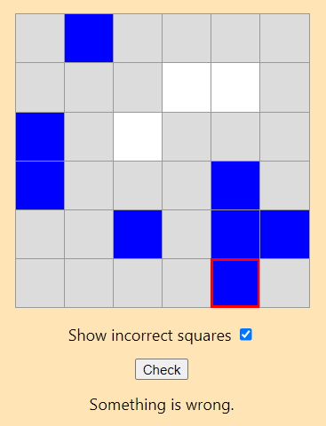

# React-based Three-in-a-Row Game

## Summary
* The game itself is based on the Daily 3-In-A-Row game on [BrainBashers](https://www.brainbashers.com/show3inarow.asp). 
* This React application uses the API data from both the original sample (https://threeinarowpuzzle.herokuapp.com/sample) and random links (https://threeinarowpuzzle.herokuapp.com/random).
* The React application makes use of React Routing to allow both the sample game grid and a random one to be chosen via links.

## How to play
* __Rules:__
  - Fill the grid with squares containing Blue and White.
  - A 3-In-A-Row of the same colour is not allowed.
  - Each row and column has an equal number of Blue and White squares.
  - Squares that are assigned a color when the puzzle loads are not changeable with mouse clicks.

* __Mouse Usage__
Left-click = Blank (color Grey) >> Blue >> White >> Blank

* __Checking__
If you click 'Check' the system will check for incorrect squares and display one of the following status outputs:
  1.	“So far so good” (all colored squares are correct but the puzzle is incomplete)
  2.	“Something is wrong” (one or more of the colored squares is incorrectly assigned)
  3.	“You did it!” (all squares are correct and the puzzle has been completely filled in)

  If 'Show incorrect squares' is checked at the same time, then they will be marked with a red border.
  